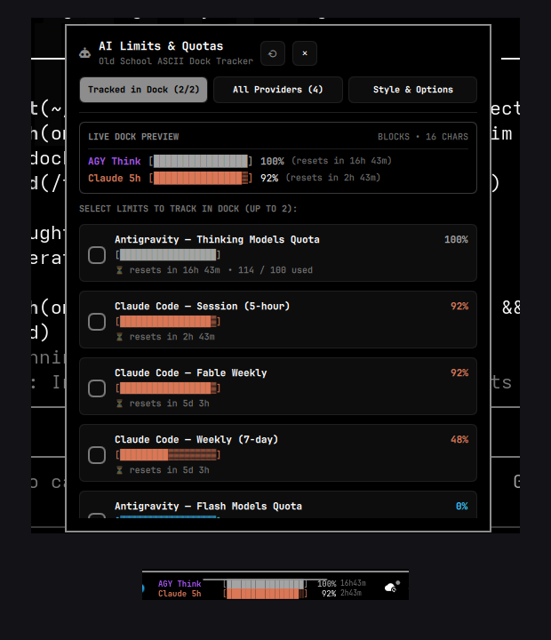

# Omarchy AI Limits Tracker Plugin 🤖📊

[](https://github.com/omacom/omarchy)
[](https://opensource.org/licenses/MIT)

An old-school ASCII progress bar widget for the [Omarchy](https://github.com/omacom/omarchy) dock that tracks rate limits and usage allowances for your installed AI providers in real-time.

```text
+-------------------------------------------------------------+
| AGY Think [████████████████] 100% 16h43m                    |
| Claude 5h [███████████████░]  92%  2h43m                    |
+-------------------------------------------------------------+
```



---

## ✨ Features

- **📺 Old-School ASCII Progress Bars**: Displays authentic terminal-style progress bars right in your Omarchy bottom dock.
- **⚡ Dual-Limit Tracking**: Track up to **2** different AI limits or providers simultaneously in a compact, two-line stacked HUD layout.
- **🔍 Auto-Discovery**: Automatically discovers and parses quota and rate-limit data from any installed Omarchy AI provider:
  - **Claude Code**: 5-hour session window, weekly 7-day quota, Fable weekly limits.
  - **Grok**: Weekly allowance, Grok Build, Grok Chat, Grok Tasks.
  - **Google Antigravity**: Thinking Models Quota, Flash Models Quota, Claude 5h Session Window.
  - **OpenAI Codex**, **Fireworks AI**, **OpenCode**, and custom agent integrations.
- **🎨 6 ASCII Styles**:
  - `blocks`: `[████████░░░░░░░░]` (Default modern blocks)
  - `shaded`: `[▓▓▓▓▓▓▓▓░░░░░░░░]` (Dithered shading)
  - `ascii`: `[=======>        ]` (Classic CLI arrow)
  - `retro`: `[########--------]` (80s BBS / Retro style)
  - `squares`: `[■■■■■■■■□□□□□□□□]` (Unicode square boxes)
  - `braille`: `[⣿⣿⣿⣿⣿⣿⣀⣀⣀⣀⣀⣀]` (High-density braille)
- **🎛️ Interactive Popup Dashboard**:
  - **Live Dock Preview**: Test and view your dock layout in real-time.
  - **Limit Selector**: Easily toggle and select which 2 limits appear in the dock.
  - **All Providers Overview**: Detailed status cards with tokens, sessions, reset times, and raw allowance numbers.
  - **Style Customizer**: Interactive buttons to change bar styles, bar length (8 to 32 characters), and toggle labels, percentages, and reset countdowns.
- **🖱️ Instant Mouse Controls**:
  - **Left Click**: Open / close full configuration dashboard.
  - **Right Click**: Instantly cycle between ASCII bar styles.
  - **Middle Click**: Force an immediate refresh from local agent state files.
- **📡 Omarchy IPC Support**: Full CLI scriptability via `omarchy-shell`.

---

## 🚀 Installation

### 1. Clone the repository
```bash
cd ~/Github
git clone https://github.com/gladimdim/omarchy-ai-limits-plugin.git
```

### 2. Symlink into Omarchy plugins directory
```bash
ln -s ~/Github/omarchy-ai-limits-plugin ~/.config/omarchy/plugins/gladimdim.ai-limits
```

### 3. Enable the plugin in Omarchy shell
```bash
omarchy plugin enable gladimdim.ai-limits --section right
```

Or manually add it to your `~/.config/omarchy/shell.json` in `bar.layout.right`:

```json
{
  "bar": {
    "layout": {
      "right": [
        {
          "id": "gladimdim.ai-limits",
          "barStyle": "blocks",
          "barLength": 16,
          "tracked": [
            "antigravity:thinking-models-quota",
            "claude:session-5-hour"
          ]
        }
      ]
    }
  }
}
```

### 4. Restart or reload Omarchy shell
```bash
omarchy restart shell
```

---

## ⚙️ Configuration Reference

All settings can be tweaked directly in `~/.config/omarchy/shell.json` or via the interactive popup dashboard:

| Setting | Type | Default | Description |
| :--- | :--- | :--- | :--- |
| `tracked` | `array` | `["claude:session-5-hour", "grok:weekly"]` | Array of limit IDs to display in dock (up to 2). |
| `barStyle` | `string` | `"blocks"` | ASCII style: `blocks`, `shaded`, `ascii`, `retro`, `squares`, `braille`. |
| `barLength` | `integer` | `16` | Length of progress bar body in characters (8–32). |
| `showLabel` | `boolean` | `true` | Show short provider label (e.g. `Claude 5h`, `AGY Think`). |
| `showPercent` | `boolean` | `true` | Show percentage number (e.g. `92%`). |
| `showReset` | `boolean` | `true` | Show relative countdown until quota reset (e.g. `2h43m`). |
| `coloredBars` | `boolean` | `true` | Colorize progress bars using provider brand colors. |
| `refreshIntervalSec` | `integer` | `60` | Background refresh interval in seconds. |

---

## ⌨️ Omarchy IPC Commands

You can control or query the plugin from terminal, scripts, or Hyprland keybindings using `omarchy-shell`:

```bash
# Open popup dashboard
omarchy-shell gladimdim.ai-limits open

# Close popup dashboard
omarchy-shell gladimdim.ai-limits close

# Toggle popup dashboard
omarchy-shell gladimdim.ai-limits toggle

# Cycle to next ASCII progress bar style
omarchy-shell gladimdim.ai-limits nextStyle

# Force refresh data from agent logs
omarchy-shell gladimdim.ai-limits refresh

# Get current status and active limits JSON
omarchy-shell gladimdim.ai-limits debugInfo
```

---

## 👤 Author

**Dmytro Gladkyi**
- GitHub: [@gladimdim](https://github.com/gladimdim)

## 📄 License

This project is licensed under the [MIT License](LICENSE).
